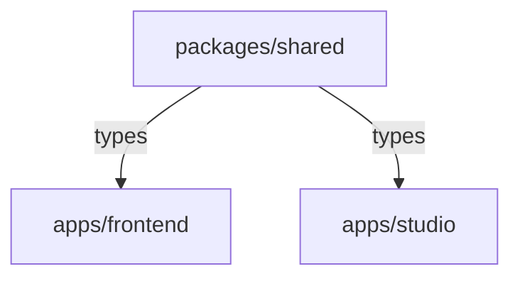

# 🏗️ Monorepo CI/CD Configuration

Dette dokumentet forklarer hvordan CI/CD er satt opp for å håndtere monorepo-strukturen med både frontend og studio.

## 📦 Prosjektstruktur

```
santan/
├── apps/
│   ├── frontend/          # React app (TanStack Start)
│   │   ├── Dockerfile     # Multi-stage build
│   │   └── ...
│   └── studio/            # Sanity Studio
│       ├── Dockerfile     # Multi-stage build (valgfri)
│       └── ...
└── packages/
    └── shared/            # Auto-genererte Sanity types
        └── src/types/     # MUST BUILD FIRST
```

## 🔄 Build Dependencies



**Kritisk:** `packages/shared` MÅ bygges før andre packages, siden den inneholder:
- Auto-genererte Sanity types
- Shared TypeScript interfaces
- Type literals og enums

## 🎯 Workflow Strategy

### 1. Intelligent Path Detection

Alle workflows bruker `dorny/paths-filter@v3` for å detektere hva som har endret seg:

```yaml
filters:
  shared:   'packages/shared/**'
  frontend: 'apps/frontend/**' ELLER 'packages/shared/**'
  studio:   'apps/studio/**' ELLER 'packages/shared/**'
```

**Fordeler:**
- ✅ Bygger kun det som trengs
- ✅ Spar CI-tid og ressurser
- ✅ Raskere feedback
- ✅ Lavere kostnader

### 2. Build Order Enforcement

#### I GitHub Actions:
```yaml
jobs:
  build-shared:
    # Bygger shared først
    
  lint:
    needs: [build-shared]
    # Laster ned shared artifacts
    
  build-frontend:
    needs: [build-shared]
    # Laster ned shared artifacts
    
  build-studio:
    needs: [build-shared]
    # Laster ned shared artifacts
```

#### I Docker:
```dockerfile
# Stage 1: Build shared package
FROM node:22-alpine AS shared-builder
COPY packages/shared ./packages/shared
RUN npm run build

# Stage 2: Build frontend (bruker shared)
FROM node:22-alpine AS builder
COPY --from=shared-builder /app/packages/shared ./packages/shared
COPY apps/frontend ./apps/frontend
RUN npm run build
```

## 🚀 CI Workflow (ci.yml)

### Trigger
- Push til `main`/`develop`
- Pull requests

### Flow

```
1. Detect Changes
   ├─ shared?   (packages/shared/**)
   ├─ frontend? (apps/frontend/** OR packages/shared/**)
   └─ studio?   (apps/studio/** OR packages/shared/**)
   
2. Build Shared (if any changes)
   └─ Upload artifacts
   
3. Parallel Jobs (only for changed apps)
   ├─ Lint
   ├─ Type Check
   ├─ Build Frontend (download shared artifacts)
   ├─ Build Studio (download shared artifacts)
   └─ Tests
   
4. CI Success Check
```

### Eksempel Outputs:
```
Changes detected:
  shared: true
  frontend: true
  studio: false

Jobs that will run:
  ✓ build-shared
  ✓ lint
  ✓ type-check
  ✓ build-frontend
  ✗ build-studio (skipped)
  ✓ test
```

## 🔍 PR Preview Workflow (pr-preview.yml)

### Intelligente Previews

```
1. Detect Changes
   
2. Build Shared (if needed)
   
3. Deploy Changed Apps:
   
   IF frontend changed:
     ├─ Build Docker image (includes shared)
     ├─ Deploy to Cloud Run
     └─ Return preview URL
   
   IF studio changed:
     ├─ Build studio
     ├─ Upload artifacts
     └─ Note in PR comment
```

### PR Comment Eksempel:

**Scenario 1: Begge endret**
```markdown
## 🚀 Preview deployments

### ✅ Frontend
**Preview URL:** https://santan-frontend-pr-42-xyz.run.app

### ✅ Studio
Build successful. Artifacts available for download.
Deploy to Sanity manually if needed:
```bash
cd apps/studio
npm run deploy
```

**Changes detected:**
- 🌐 Frontend
- 🎨 Studio
```

**Scenario 2: Kun frontend endret**
```markdown
## 🚀 Preview deployments

### ✅ Frontend
**Preview URL:** https://santan-frontend-pr-42-xyz.run.app

**Changes detected:**
- 🌐 Frontend
```

## 🏗️ Production Deployment

### Frontend Deployment (deploy-cloud-run.yml)

**Trigger:**
- Push til `main` eller `production`
- Kun hvis `apps/frontend/**` eller `packages/**` endret

**Build Process:**
1. Docker multi-stage build
2. Installerer alle dependencies
3. Bygger `packages/shared`
4. Bygger `apps/frontend`
5. Optimalisert produksjonsimage

**Deployment:**
- Service: `santan-frontend`
- Region: `europe-west1`
- Memory: 1Gi
- CPU: 1
- Min instances: 0
- Max instances: 10

### Studio Deployment (Anbefalt: Sanity Hosting)

**Standard deployment til Sanity:**
```bash
cd apps/studio
npm run deploy
```

**Alternativ: Cloud Run (deploy-studio.yml)**
- Kun manuell trigger
- Self-hosted alternativ
- Service: `santan-studio`

## 🧹 Cleanup Workflow (cleanup-preview.yml)

**Trigger:** PR lukkes

**Cleanup for frontend:**
1. Sletter Cloud Run service `santan-frontend-pr-{number}`
2. Sletter alle Docker images for denne PR
3. Kommenterer på PR

**Cleanup for studio:**
- Artifacts slettes automatisk etter 7 dager
- Ingen manuell cleanup nødvendig

## 💡 Best Practices

### ✅ DO:

1. **Alltid regenerer types ved schema-endringer:**
   ```bash
   cd apps/studio
   npm run generate-types
   git add packages/shared/src/types/
   git commit -m "Update Sanity types"
   ```

2. **Commit shared og apps sammen:**
   ```bash
   # God praksis
   git add packages/shared apps/frontend apps/studio
   git commit -m "Add new content type with frontend and studio support"
   ```

3. **Test lokalt først:**
   ```bash
   # Test shared build
   npm run build --workspace=@santan/shared
   
   # Test frontend build
   npm run build --workspace=@santan/frontend
   
   # Test studio build
   npm run build --workspace=@santan/studio
   ```

4. **Bruk Turborepo for local dev:**
   ```bash
   npm run dev  # Starter alt med riktig build order
   ```

### ❌ DON'T:

1. ❌ Commit frontend/studio uten å bygge shared først
2. ❌ Skip type generation etter schema-endringer
3. ❌ Manuelt endre filer i `packages/shared/src/types/` (auto-generert)
4. ❌ Deploy uten å sjekke CI status

## 🔍 Debugging

### CI feiler med "Cannot find module @santan/shared"

**Problem:** Shared package ikke bygget eller artifacts ikke lastet ned

**Løsning:**
```yaml
# Sjekk at dette er i jobben din:
- name: Download shared build
  uses: actions/download-artifact@v4
  with:
    name: shared-build
    path: packages/shared/dist
```

### Frontend build feiler i Docker

**Problem:** Shared package ikke bygget i Docker

**Løsning:** Verifiser Dockerfile har shared-builder stage:
```dockerfile
FROM node:22-alpine AS shared-builder
COPY packages/shared ./packages/shared
WORKDIR /app/packages/shared
RUN npm run build

FROM node:22-alpine AS builder
COPY --from=shared-builder /app/packages/shared ./packages/shared
# ... rest of build
```

### Type errors i CI men ikke lokalt

**Problem:** Local node_modules ut av sync

**Løsning:**
```bash
rm -rf node_modules apps/*/node_modules packages/*/node_modules
npm install
npm run build --workspace=@santan/shared
```

### PR preview viser gammel kode

**Problem:** Docker cache bruker gammel shared build

**Løsning:**
```bash
# Force rebuild uten cache
docker build --no-cache -t test -f apps/frontend/Dockerfile .
```

## 📊 Performance Optimization

### Caching Strategy

**GitHub Actions:**
- ✅ npm dependencies cached (`actions/setup-node@v4` med `cache: 'npm'`)
- ✅ Shared build artifacts mellom jobs
- ✅ Docker layer caching i Cloud Build

**Build Times (estimat):**
- Full build (alle apper): ~5-8 minutter
- Kun frontend endret: ~3-5 minutter
- Kun linting/type-check: ~1-2 minutter

### Cost Optimization

**Strategi:**
1. Path filters - Kjør kun nødvendige workflows
2. Conditional jobs - Skip uendrede apper
3. Artifacts retention - 7 dager for previews
4. Preview cleanup - Automatisk ved PR close
5. Min instances: 0 for previews (scale to zero)

**Estimerte kostnader:**
- CI: Gratis (GitHub Free tier)
- Cloud Run frontend: $5-15/måned
- Cloud Run previews: ~$1-2 per aktiv PR
- Storage (GCR): ~$0.50-2/måned

## 📚 Related Documentation

- [GITHUB_CI_SETUP.md](../GITHUB_CI_SETUP.md) - Fullstendig setup guide
- [TYPE_MIGRATION.md](../TYPE_MIGRATION.md) - Type generation workflow
- [turbo.json](../turbo.json) - Turborepo konfiguration
- [.github/workflows/README.md](./README.md) - Workflows oversikt

## 🆘 Support

For problemer:
1. Sjekk workflow logs i GitHub Actions
2. Verifiser at shared package bygges korrekt
3. Test Docker build lokalt
4. Se denne guiden for vanlige problemer
5. Åpne issue hvis problemet vedvarer

